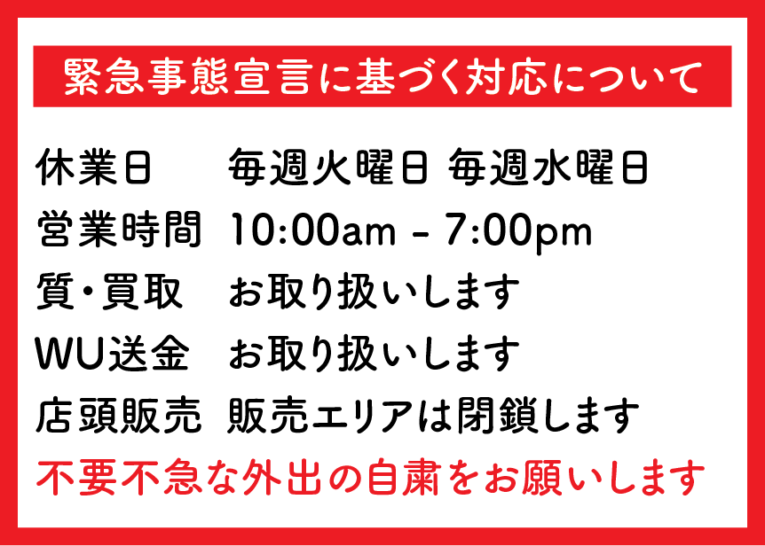

# 【重要】緊急事態宣言に基づく対応について

お客様各位

いつも当店をご利用いただきありがとうございます。

新型コロナウイルスの感染拡大に備える改正特別措置法（新型コロナ特措法）に基づき、緊急事態宣言が4月7日発令されました。

対象は、東京、神奈川、埼玉、千葉、大阪、兵庫、福岡の7都府県で、期間は当面、1ヶ月程度と報道されています。

埼玉県にあります当社では2020年4月9日より、下記の通り対応いたします。

本件は緊急事態宣言の対象期間に限った措置であり取引環境が正常に戻ることを前提としております。

## 休業日

- 毎週火曜日（4/14 4/21 4/28 5/5）
- 毎週水曜日（4/15 4/22 4/29 5/6）
- 政府・行政機関・公安委員会の要請に基づき、お客様への予告なく休業をする場合がございます。

## 営業時間

10:00am - 7:00pm

## 質と買取

1. 質・買取カウンターは通常通り営業いたします。
2. 金・プラチナのインゴットの買取および質入れに付きまして状況に応じてお断りする場合がございます。
3. 質料のお支払いは銀行振込にて受付可能でございます。
4. お預け頂いているお品物の受け戻しをご希望のお客様は、ご来店前に営業日時をご確認ください。
5. 流質期限を過ぎているお品物のお取り扱いに関しましては早めにご相談ください。

## ウェスタンユニオンの送金サービス

1. 通常通りお取り扱いいたします。
2. WU本部の指示により金額やご送金できる国の制限がございます。

## 店頭販売

1. 期間中は**販売エリアは閉鎖**とさせていただきます。
2. 商品は[ヤフーオークション](https://auctions.yahoo.co.jp/seller/pawnshopiko)および[ヤフーショッピング](https://shopping.geocities.jp/pawnshopiko/#/?_k=nn2utr)に出品してございますので、そちらのご利用ください。
3. 運送会社の状況によってはお送りできないエリアが発生する可能性がございます。
4. 配達に要する日数が通常よりも長くなる可能性がございます。

## 待機場所につきまして

お車でご来店のお客様で、ご希望の方は駐車場にお止めいただいた車内にてお取引をすることも可能でございます。

ご不明な点がございましたらお気軽に[お問い合わせ](https://www.officeiko.co.jp/contact/)ください。

2020年4月7日

株式会社オフィスイコー

