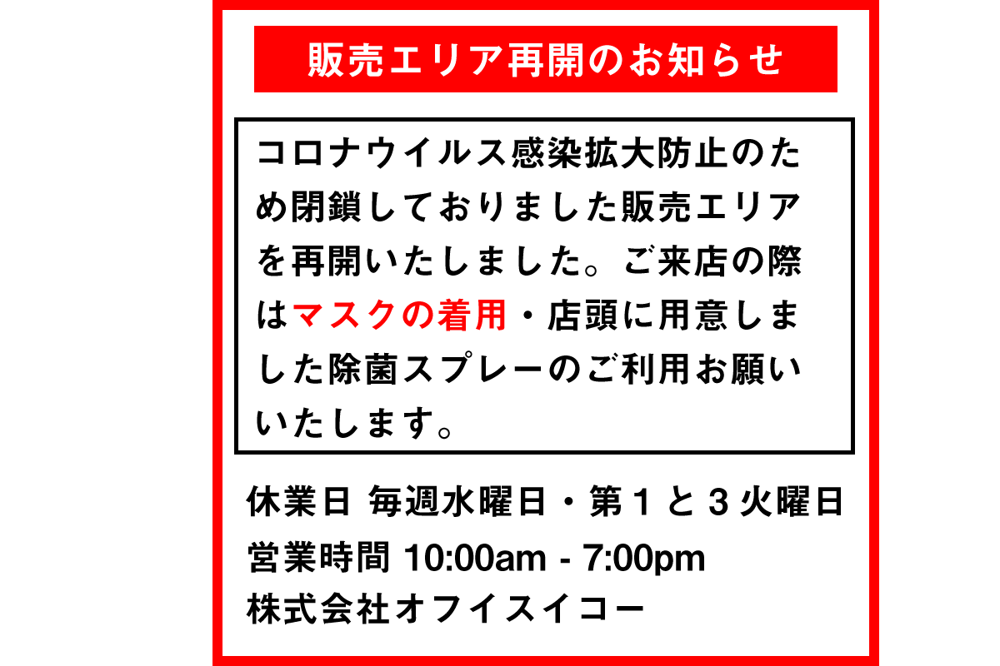

# 【重要】販売エリア再開のおしらせ

お客様各位

いつも当店をご利用いただきありがとうございます。

コロナウイルス感染拡大防止のために一時的に閉鎖しておりました販売エリアを再開いたしましたのでお知らせいたします。

ご来店の際は<em>マスクの着用</em>と店頭に用意いたしました除菌スプレーのご利用をお願いいたします。

## 休業日

- 毎週水曜日
- 第１火曜日・第３火曜日
- 政府・行政機関・公安委員会の要請に基づき、お客様への予告なく休業をする場合がございます。

## 営業時間

10:00am - 7:00pm

## 質と買取

1. 質・買取カウンターは通常通り営業いたします。
2. 金・プラチナのインゴットの買取および質入れに付きまして状況に応じてお断りする場合がございます。
3. 質料のお支払いは銀行振込にて受付可能でございます。

## ウェスタンユニオンの送金サービス

1. 通常通りお取り扱いいたします。
2. WU本部の指示により金額やご送金できる国の制限がございます。
3. ご自宅で準備のできる[送金フォーム作成ツール](https://wu-form.officeiko.co.jp/)をご用意しました。ご来店前に作成してお持ちいただきますとスムーズにお手続きが可能でございます。

## 店頭販売

1. 商品の陳列方法を一部変更し、密になりにくい配置に変更いたしました。できる限りの換気を心がけております。また、高額品の展示はいたしておりませんので、ご覧になりたい商品がございましたらスタッフまでお問い合わせください。
2. 商品は[ヤフーオークション](https://auctions.yahoo.co.jp/seller/pawnshopiko)および[ヤフーショッピング](https://shopping.geocities.jp/pawnshopiko/#/?_k=nn2utr)に出品してございますので、そちらのご利用ください。
3. 運送会社の状況によってはお送りできないエリアが発生する可能性がございます。
4. 配達に要する日数が通常よりも長くなる可能性がございます。

## 待機場所につきまして

お車でご来店のお客様で、ご希望の方は駐車場にお止めいただいた車内にてお取引をすることも可能でございます。

ご不明な点がございましたらお気軽に[お問い合わせ](https://www.officeiko.co.jp/contact/)ください。

2020年5月15日

株式会社オフィスイコー

