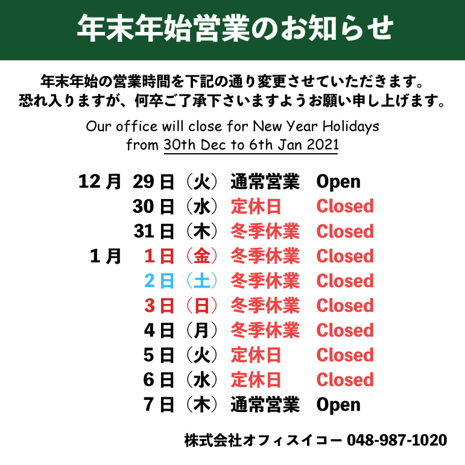



平素は格別のご高配を賜り厚く御礼申し上げます。誠に勝手ながら下記日程を冬季休業とさせていただきます。

    

        2020/12/30(水) - 2021/01/06(水)
    

期間中に質の期限が到来する場合には、その期限を2021/01/10（日）とさせていただきます。

  
年内は12月29日まで営業いたします

ご不明な点がございましたらスタッフまでお問い合わせください。

We are closing above period for the winter holiday. 

If the deadline of your pawn contracts expire in this period, it will be extended until 10th of January 2021. 

The services of Western Union will also be unavailable for this period.

If you have any questions please feel free to contact us in the opeing hour. Thank you for your understanding.

