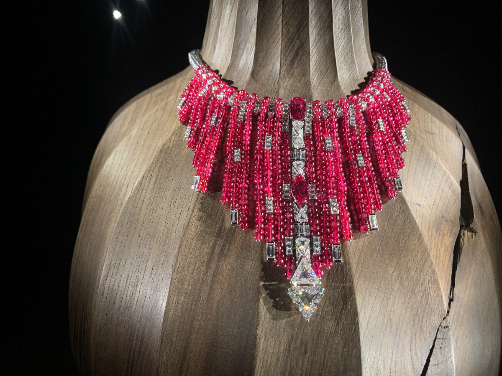

2019年10月2日から2019年12月16日まで六本木にある国立新美術館で開催されていたカルティエの展示会「カルティエ、時の結晶」に、ちょっと前になりますが行ってきました。

### チケットは大人1600円

### 国立 **新** 美術館ですができてもう10年以上になります

不思議なデザインの置き時計から始まり、見覚えのある腕時計やみたこともない豪華なジュエリーがたくさん、そして、デザインのモチーフとなった動植物の詳細なスケッチなどが展示されていました。[オンライン](https://cartier2019.exhn.jp/)でも一部ご覧になることができます。ほとんどのエリアは撮影不可なのですが、最近のは流行なのか一部の作品の撮影が可能なエリアが設けられていましたので、そこで撮影した写真を貼っておきます！

もうどれもお値段とか想像もつかない作品ばかり(@_@)、展示の仕方もとても凝っていましたね（構図が平凡なのは撮影者が未熟なためです>.<）。

以前に当店で買取させていただいた、

この子の相棒も展示（撮影不可エリア）されていました！
