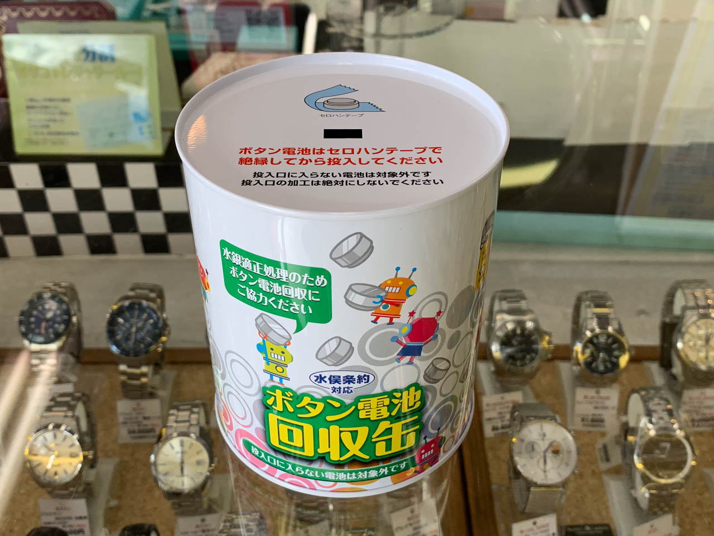
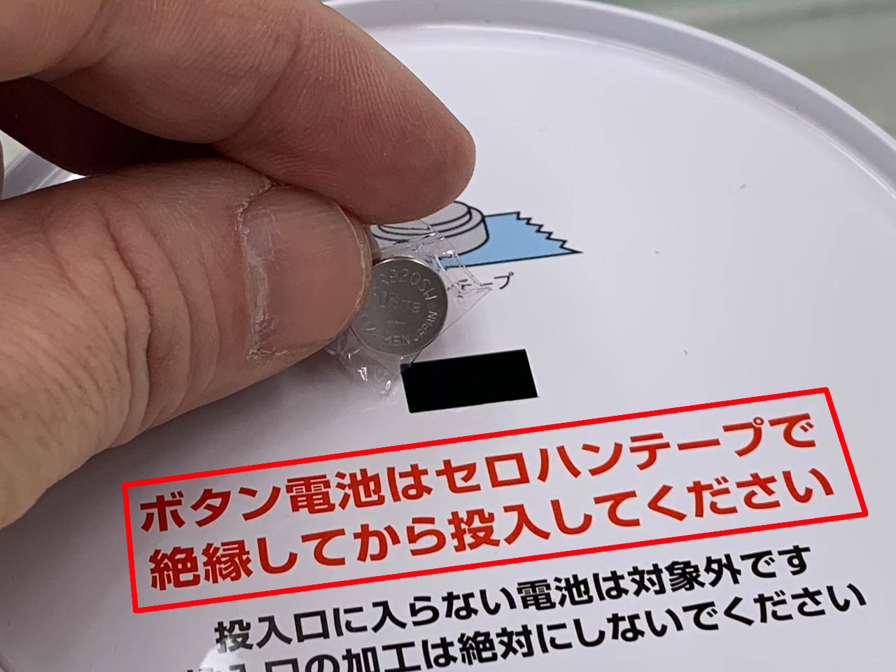
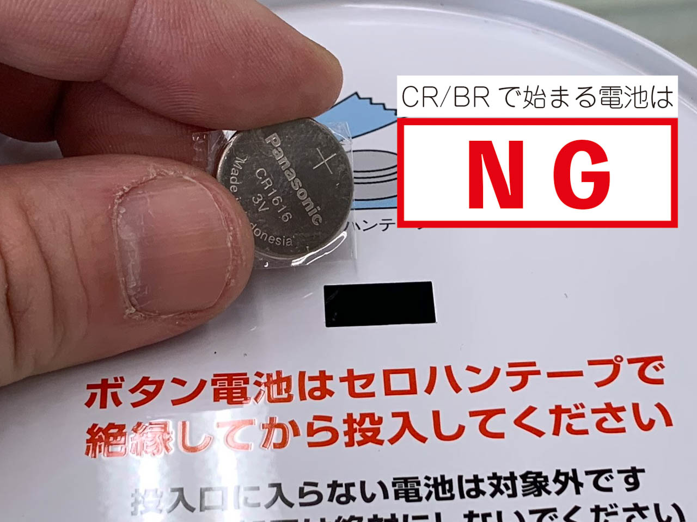

2018年の11月終わりに大阪のホームセンターが全焼する事故がございました。その原因は保管していた廃棄前の使用済み電池がショートして出火したものとされています。当店でも時計の電池交換の際に不要となったボタン電池が大量にありました。この事故を教訓として当店でも、これらを適正に処理するるため、回収のお手伝いをするボタン電池回収協力店となりました。

また、環境保護の観点から、当店にてご依頼頂いた時計の電池交換の際に不要となったボタン電池はもちろんのこと、お客様にて補聴器や電子体温計などの電池交換の際に余った電池も回収させていただきます。当店内に備え付けの回収缶をお気軽にご利用ください。

なお、下記の通り一部制限がございますのでご注意ください。詳細は[一般社団法人電池工業会様のサイト](http://www.botankaishu.jp/m/top.php)を御覧ください。

## 回収対象の電池

酸化銀電池（SRで始まるもの）、空気電池（PRで始まるもの）、アルカリボタン電池（LRで始まるもの）が対象となります。また、これらの電池であっても、缶に入らない物は対象外となります。

### 回収対象のブランド

#### 電池関連
- FUJITSU／FDK／SANYO／SONY／TOSHIBA／Panasonic／maxell／MITSUBISHI／HITACHI／SEIZAIKEN／SPRON／muRata

#### 時計関連
- SEIKO／CITIZEN

#### 補聴器関連
- powerone／NJH／リオネット／WIDEX／CORTITON／RIKEN／oticon／PHONAK／bernafon／DURACELL／SIEMENS／signia／STARKEY／NEXcell／ultima／Rayovac／ReSound

必ずセロテープなどで絶縁してください。

## 対象外の電池

似た形状ですがやや大きめの電池で、ゲーム機や車のリモコンなどに使用する大きめのリチウムコイン電池（型番がCRまたはBRで始まるもの）がございます。これらは回収の対象ではございませんのでご注意ください。各自治体のルールに従って処分することが可能です（ごみステーションなど）。

お店の時計売り場中央に設置しておりますので、お気軽にご利用ください。缶は結構小さいですので、満杯になった場合には不要のボタン電池をお預かりしたうえで当店に適切に処理させていただきます。詳しくは当店スタッフまでお問い合わせください。
