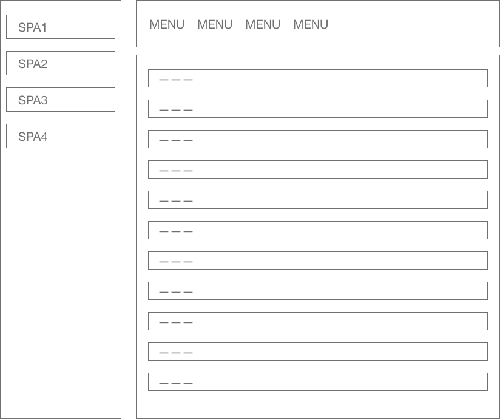

## はじめに

現在作っている社内向けの業務アプリには、共通のヘッダやメニューを持つ静的な親となるページがあります。その子ページとして、複数のシングルページアプリケーション(SPA)を切り替えて動かすという実装を試みています。すべての機能を一つのSPAにまとめようとすると、開発やメンテナンスも大変なので、少しずつ作っていける手法としてどうかなと思って採用してみました。いうなれば、マルチページシングルページアプリケーション（!?）となります。



ElmでSPAを開発する際にはプログラムの入り口なる関数として[`Browser.application`](https://package.elm-lang.org/packages/elm/browser/latest/Browser#application)を使います。けっこう複雑な仕組みを伴うので、[elm-spa-example](https://github.com/rtfeldman/elm-spa-example)という実装例を参考にしてゴリゴリ書く場合が多いです。個人的にはよりシンプルなElmのパッケージサイトの[ソース](https://github.com/elm/package.elm-lang.org)を参考にするケースが多いです。また、最近では[elm-spa](https://github.com/ryannhg/elm-spa/)というツールが流行っていたりまだ使ったことはありません）、さらに*うさぎさ*んが作られた[alchelmy](https://qiita.com/hiruberuto/items/0b92bca97632bad9a3b8)というツールもあります（まだ使ったことはありません…）。

いずれも`Browser.Navigation`というモジュールと合わせて使います。基本的な説明やパターンは公式ガイドの[ナビゲーション](https://guide.elm-lang.jp/webapps/navigation.html)の節に記載があります。普通にSPAを作る場合にはこのままで問題ないのですが、先のマルチページシングルページアプリケーションを実装しようとすると、ナビゲーションの部分で問題が出てきました。具体的には`Browser.application`が`<body>`タグ以下をすべて乗っ取ってしまうため、共通項目としてベースとなるHTMLに書いたヘッダーやメニューが表示されなくなってしまいます。いろいろと調べていると、`Browser.element`を使って任意のノードのSPAをマウントして、ナビゲーション自体は`port`を使ってJavascriptサイドで行う方法の解説、[How do I manage URL from a Browser.element?](https://github.com/elm/browser/blob/master/notes/navigation-in-elements.md)がありました。ブラウザの拡張プラグインやアナリティクスのコードとバッティングするときもこの方法を使うと良いとう議論も多くみかけます。

この解説に詳しく説明は書いてあるのですが、実際の実装例が見つけられず、自分の理解不足を補うためにも実装してみて気づいた点をここにまとめておきます。

## 環境

- Elm 0.19.1

## 公式ガイドのサンプル

先にあげた公式ガイドのサンプルが下記のコードになります。

```elm
module Main exposing (..)

import Browser
import Browser.Navigation as Nav
import Html exposing (..)
import Html.Attributes exposing (..)
import Url


-- MAIN


main : Program () Model Msg
main =
  Browser.application
    { init = init
    , view = view
    , update = update
    , subscriptions = subscriptions
    , onUrlChange = UrlChanged
    , onUrlRequest = LinkClicked
    }


-- MODEL


type alias Model =
  { key : Nav.Key
  , url : Url.Url
  }


init : () -> Url.Url -> Nav.Key -> ( Model, Cmd Msg )
init flags url key =
  ( Model key url, Cmd.none )


-- UPDATE


type Msg
  = LinkClicked Browser.UrlRequest
  | UrlChanged Url.Url


update : Msg -> Model -> ( Model, Cmd Msg )
update msg model =
  case msg of
    LinkClicked urlRequest ->
      case urlRequest of
        Browser.Internal url ->
          ( model, Nav.pushUrl model.key (Url.toString url) )

        Browser.External href ->
          ( model, Nav.load href )

    UrlChanged url ->
      ( { model | url = url }
      , Cmd.none
      )


-- SUBSCRIPTIONS


subscriptions : Model -> Sub Msg
subscriptions _ =
  Sub.none


-- VIEW


view : Model -> Browser.Document Msg
view model =
  { title = "URL Interceptor"
  , body =
      [ text "The current URL is: "
      , b [] [ text (Url.toString model.url) ]
      , ul []
          [ viewLink "/home"
          , viewLink "/profile"
          , viewLink "/reviews/the-century-of-the-self"
          , viewLink "/reviews/public-opinion"
          , viewLink "/reviews/shah-of-shahs"
          ]
      ]
  }


viewLink : String -> Html msg
viewLink path =
  li [] [ a [ href path ] [ text path ] ]
```

サンプルコードの内容に関しましては、日本語に翻訳されたガイドに[詳しい説明](https://guide.elm-lang.jp/webapps/navigation.html)がありますのでそちらを参照してください。

## `Browser.element`を使ってナビゲーションをする

先の解説を参考に各パート毎に書き換えていきます。

### 導入部

```elm
port module Main exposing (..)

import Browser
import Html exposing (..)
import Html.Attributes exposing (..)
import Html.Events exposing (..)
import Json.Decode as D
import Url
```

portを使用するための宣言をモジュールの先頭に加えます。また、`Browser.Navigation`は不要となるので削除します。また後ほど定義する関数で使用するパッケージ`Json.Decode`と`Url`および`Html.Events`を追加します。

### MAIN

```elm
-- MAIN


main : Program String Model Msg
main =
    Browser.element
        { init = init
        , view = view
        , update = update
        , subscriptions = subscriptions
        }

```

プログラムの入り口を`Browser.element`に変更し、引数となるレコードから不要な`onUrlChange`と`onUrlRequest`を削除します。`Flags`として受け取る値の型を`String`に変更します。

### MODEL

```elm
-- MODEL


type alias Model =
    { url : Maybe Url.Url
    }


init : String -> ( Model, Cmd Msg )
init locationHref =
    ( Model (locationHrefToRoute locationHref), Cmd.none )
```

初期のURLを文字列として受け取ります。Flagsでは`Url.Url`としては受け取ることはできません。また、`Browser.Navigation.Key`も`Browser.application`以外では生成されないため不要となります。さらに後ほど説明しますが、`Model`に保持する`Url.Url`を`Maybe`でラップします。

### UPDATE

```elm
-- UPDATE


type Msg
    = LinkClicked String
    | UrlChanged (Maybe Url.Url)


update : Msg -> Model -> ( Model, Cmd Msg )
update msg model =
    case msg of
        LinkClicked url ->
            ( model, pushUrl url )

        UrlChanged url ->
            ( { model | url = url }
            , Cmd.none
            )
```

`LinkClicked`は後ほど定義する、`a`タグの代わりとなるSPA内部向けのリンクを処理する`link`関数で呼ばれます。これまで、`Browser.Internal`で行っていた処理を、portを通してJavascript側でブラウザに対してURLの変更を指示します。

今回は`UrlChanged`では受け取った`url`で`Model`の値を更新しているだけですが、本来はこの`url`を`Url.Parser`でパースして様々なページに振り分ける処理が必要となります。

### SUBSCRIPTION

```elm
-- SUBSCRIPTIONS


subscriptions : Model -> Sub Msg
subscriptions _ =
    onUrlChange (locationHrefToRoute >> UrlChanged)
```

後ほど定義するport関数`onUrlChange`が呼ばれるたびに、この`subscription`が実行されます。その結果として先程のメッセージ`UrlChnged`が発行されます。

### VIEW

```elm
-- VIEW


view : Model -> Html Msg
view model =
    div []
        [ text "The current URL is: "
        , b [] [ text (Maybe.map Url.toString model.url |> Maybe.withDefault "NOT FOUND") ]
        , ul []
            [ viewLink "/home"
            , viewLink "/profile"
            , viewLink "/reviews/the-century-of-the-self"
            , viewLink "/reviews/public-opinion"
            , viewLink "/reviews/shah-of-shahs"
            ]
        ]


viewLink : String -> Html Msg
viewLink path =
    li [] [ link (LinkClicked path) [ href path ] [ text path ] ]
```

モデルの`url`が`Maybe Url.Url`に変更されたので、それに伴う処理を追加しています。`link`関数は後ほど定義されますが、内部リンクを必要する際に`a`タグの代わりに使用します。クリックされると`LinkClicked`メッセージを発行し、port関数を経由してJavascript側へURLの変更を通知します。ここで`href`をつけないと、リンクとしてのCSSが働きませんので注意が必要です。

### NAVIGATION

```elm
port onUrlChange : (String -> msg) -> Sub msg


port pushUrl : String -> Cmd msg


link : msg -> List (Attribute msg) -> List (Html msg) -> Html msg
link href attrs children =
    a (preventDefaultOn "click" (D.succeed ( href, True )) :: attrs) children


locationHrefToRoute : String -> Maybe Url.Url
locationHrefToRoute locationHref =
    Url.fromString locationHref
```

今回の変更で追加される処理になります。port経由でブラウザのURLに変更があるとJavascript側から通知を受け取る`onUrlChange`関数と、Javascript側へURLの変更を通知する`pushUrl`関数が定義されています。`link`関数は先程の説明の通り、内部向けのリンクのための`a`タグの代わりに使う関数です。

最後の`locationHrefToRoute`関数ではJavascript側から受け取った文字列としてのURLを、`Url.fromString`関数を使って`Url.Url`に変換しますが、URLとして不正な文字列を受け取った場合に`Nothing`を返します。サーバーが不正なURLでのアクセスに対してこのSPAを呼び出していることになるため、これはサーバー側の問題であり本来はありえないはずなので、404なページなどに誘導することになります。

### Javascript側

```html
<html>
<head>
  <style>
    /* you can style your program here */
  </style>
</head>
<body>
  <main></main>
  <script>
    
    var app = Elm.Main.init({
        flags: location.href,
        node: document.querySelector('main') 
    });

    // you can use ports and stuff here

    // Inform app of browser navigation (the BACK and FORWARD buttons)
    window.addEventListener('popstate', function () {
        app.ports.onUrlChange.send(location.href);
    });

    // Change the URL upon request, inform app of the change.
    app.ports.pushUrl.subscribe(function(url) {
        history.pushState({}, '', url);
        app.ports.onUrlChange.send(location.href);
    });    
  </script>
</body>
</html>
```

Javascript側のコードは解説のとおりとなります。`elm reactor`などで開くと、`Browser.application`と同じように動作するはずです。サーバーが必要となるため`ellie`では動きませんのでご注意ください。

全てまとめめたコードをこちらの[gist](https://gist.github.com/kyasu1/d1e7192b5ae59726277ba6a1fb688898)に置いておきます。

## 終わりに

ちょっとの変更で`Browser.element`でも問題なくナビゲーションができ、マルチページシングルページアプリケーションを構成できることがわかりました。複数のElmアプリケーションを同じページに置くこともできますが、URLの管理に間違いがあると意図しない動作になる可能性があります。

- 内部リンクを呼び出す場合は全てのページで、`LinkClicked`メッセージと対応するコードを`update`関数に用意し、`port pushUrl`を呼び出す必要があります。
- `link`と`port pushUrl`は複数のモジュールから参照する可能性があるので、別のモジュールに分けておくとよいです。

