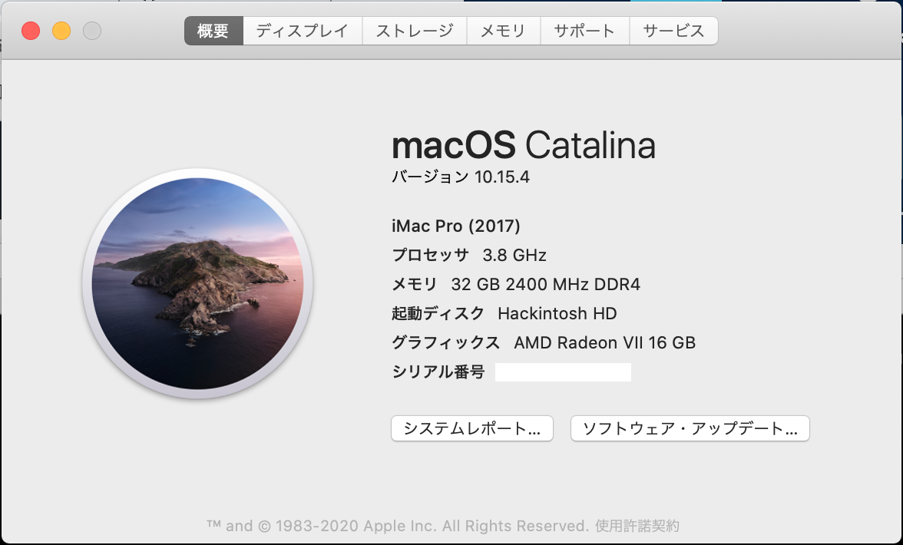
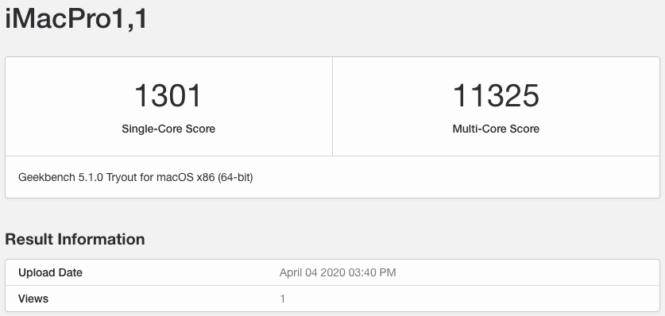
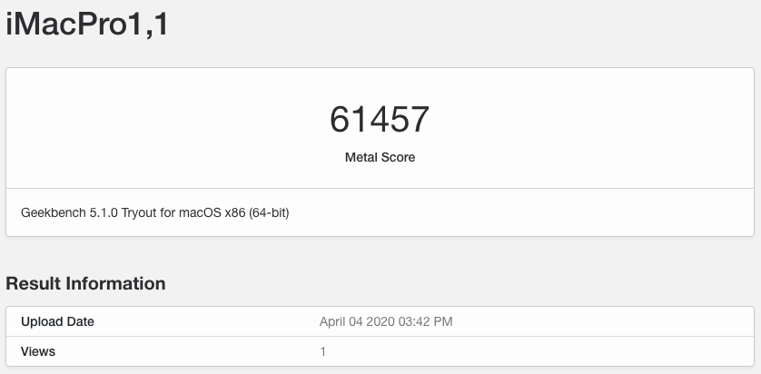
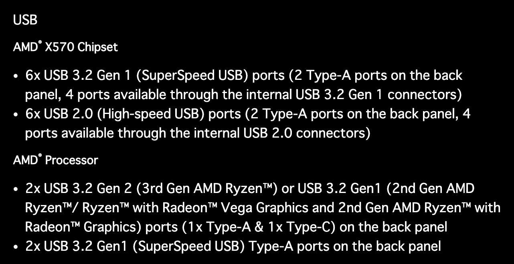
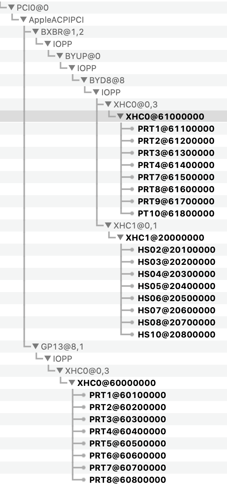
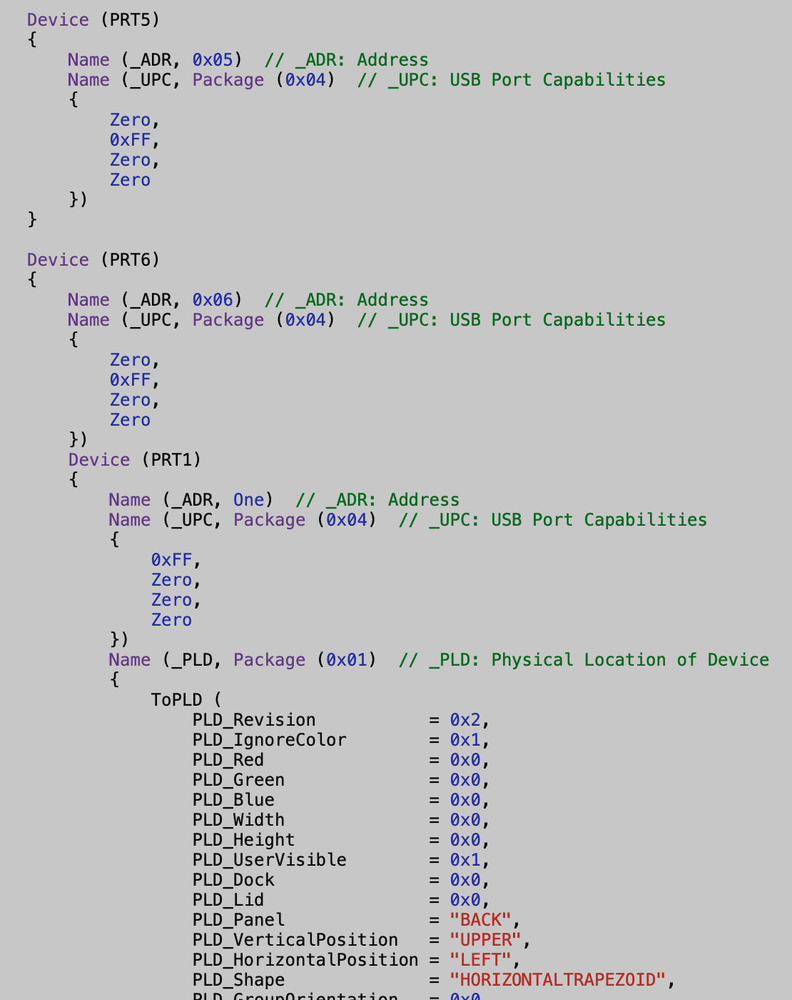
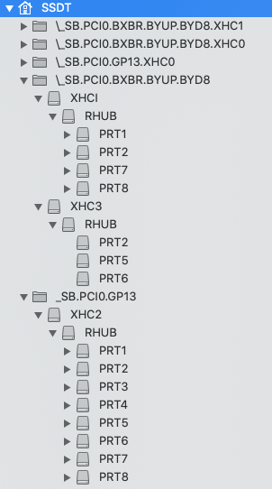
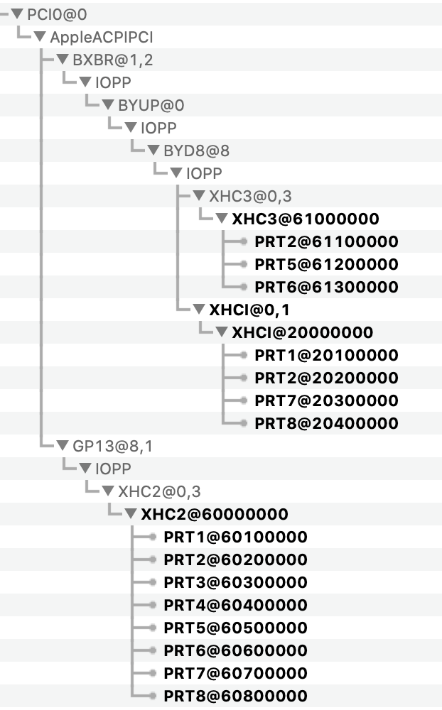
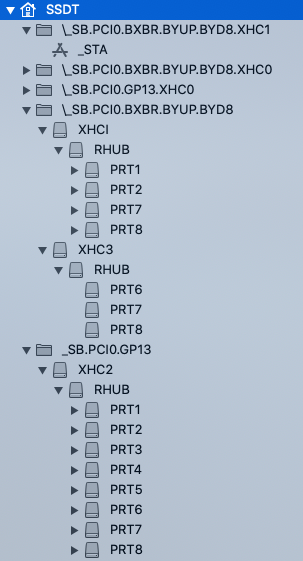

## はじめに

ADMの12コア24スレッドのCPU Ryzen 9 3900Xをリーズナブルな価格で入手することができたので、少し古くなってきたIntel Core i7-6700Kのシステムをリプレースしてみました。構成は以下の通りです。

- CPU AMD Ryzen 9 3900X
- MEM CFD W4U3200BMS-16G x 2
- M/B MSI MPG X570 GAMING PLUS
- SSD CFD CSSD-M2B1TPG3VNF
- GPU SAPPHIRE RADEON VII 16GB VD6889
- ブートローダ OpenCore 5.6
- OS macOS Catalina 10.15.4

まあ、12コアもいらないし、以前のシステムも非常に安定して不満はなかったのですが、Ryzentoshという茨の道を歩む選択をしました（実際のところ色々と問題あります…）

## このMacについて

とりあえず組み立てて、[OpenCore Guide](https://khronokernel-2.gitbook.io/opencore-vanilla-desktop-guide/)に倣って`config.plist`を作成し、必要なファイルを集めてEFIを作って起動すると、あっけなくインストール完了して起動。これまではCloverを使用して複数のマシンを構築した際の経験値もありますが、しっかりとしたガイドのおかげで、初めてOpenCoreにしてはスムーズに起動することができました。



一応ベンチの結果も貼っておきます。





負荷がかかっても安定して動作しています。鬼門のUSB絡みとスリープを除いては…

## 内部のUSBヘッダーの不具合

いざ起動して色々と設定を進めていくと、どうもマザーボード上のUSB2.0ヘッダーに繋げたBluetoothデバイスやフロントパネルのUSB2.0ポートをmacOS側で認識してくれない。

最初はマザーボードの不具合を疑ったが、BIOSやWindowsからは問題なく認識しているのでmacOS側の問題と思われる。WiFi/Bluetoothアダプタとして、fenviのFV-T919を使用しているが、Bluetoothを使うために内部のUSBポートに接続する必要がある。仕方がないのでボード上のUSB3コネクタをUSB2ピンヘッダーに変換するアダプターを購入してなんとか動作するようになった。

## 原因がわかった

その後、USBマップを作成するためにACPIやDSDTの仕組みについて調べていると、妙なことに気づいた。

このマザーボードには3系統のUSBコントローラが内蔵されていて、2系統はAMD X570チップセットが管理し、1系統はCPUに直接つながる20Gb/sに対応したUSB 3.2 Gen2ポートをサポートしている。



USB関係のSSDTやkextを何も入れない状態で起動して、IORegistryExplorerを使って確認すると次のようになる。



よく見るとBYD8/XHC0のPRT5とPRT6が抜けている。しかしDSDTを調べていると、BYD8/XCH0にPRT5とPRT6の定義が存在することがわかる（XHC1/HS??となっているのは、AppleのkextによってiMacPro1.1用に定義が上書きされているためです）。



Windows 10をインストールして確認してみるとその存在を確認することができた。どうやらPRT5にはマザーボード上のLEDコントローラが繋がっていて、PRT6には4ポートのUSB2.0ハブが繋がっている！？

この4ポートが怪しい！カスタムSSDTを作成して、BYD8/XHC0のPRT5とPRT6を定義し直してみる。



因みにここでは他のコントローラやポートも

```bash
BYD8/XHC0 -> BYD8/XHC3
BYD8/XHC1 -> BYD8/XHCI
GP13/XHC0 -> GP13/XHC2
```

となるよう名前を変更している。先程も記したが、SMBIOSに`iMacPro1.1`を指定していると、Apple本来のkextでBYD8/XCH1が上書きされてしまうので、変更しないと不具合の原因になるようである。またトータルで15ポート以下になるように使用しそうなポートのみを再定義している。

このSSDTをOC/ACPIフォルダに入れて（`config.plist`の更新を忘れずに！）起動してみると、PRT5とPRT6が現れた！



さらに詳細を見てみると、PRT6のハブの一つにBRCM20702が接続されているのが確認できました。


PRT5はマザーボード上のLED制御用と思われ、MacOSからは使いみちがなさそうなので、無効にして、必要そうなポートを15ポートに絞ったSSDTがこちら。



一応amlファイルを[こちら](/SSDT-XHC-CUSTOM.aml)を置いておきますが自己責任でお願いします。

## 終わりに

- 内部USB2.0ポートにFT-V919を接続することにより、余計な配線せずに使えるようになりました。またネイティブ対応したこのカードのおかげで、iMessage関係やAirDrop、AppleWatchでの解除も問題なく動作しています。
- 現状で、USBポートにマウスやキーボードをつなげると、スリープから復帰できない問題が残っています。Bluetoothキーボードとマウスを使えば問題なくスリープからの復帰が可能です。さらに、USB DACは問題なく使用可能。SDカードリーダーをつなげるとやはり復帰ができない。謎…
- OpenCoreガイドによれば、1コントローラあたり15ポートまでとなっているので、本来は全ポート（10/10/8）使えるようにしても良いのかも。謎…