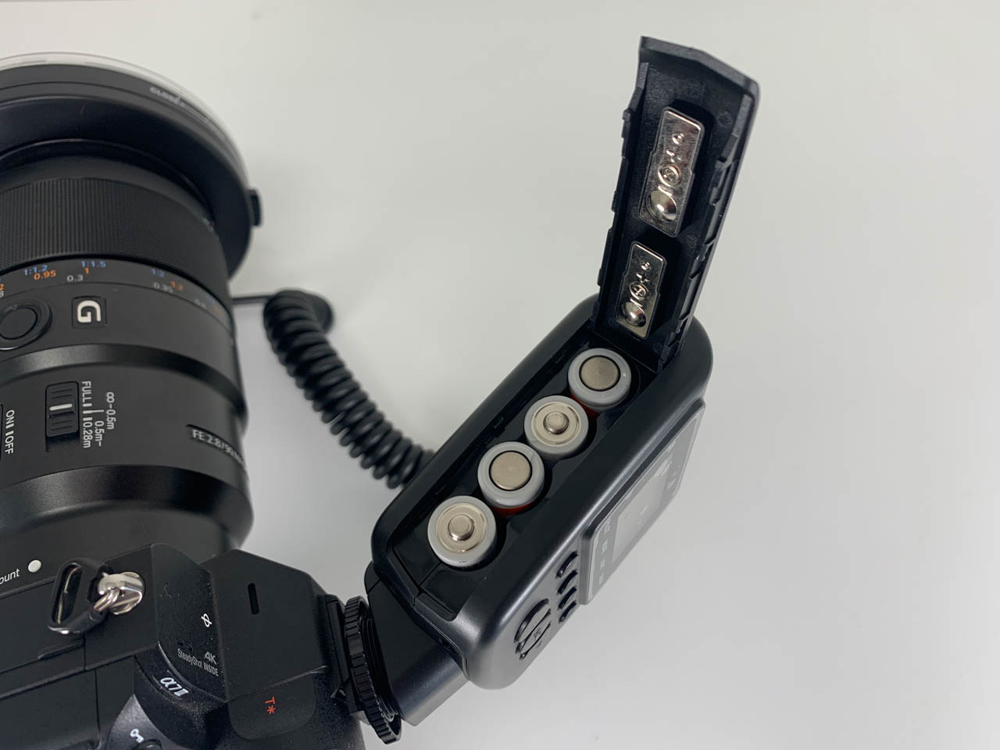

 

ジュエリーの商品撮影をする際にもっとキラキラに撮りたいと思い、手頃な中華製の[リングライト](https://www.amazon.co.jp/gp/product/B07KPY984F/)をアマゾンで購入してみました。早速届いたのでお試しです。

開封してみると、いろいろなレンズ径に適合するように複数のアダプターが付属しています。リングライトはアダプター外周のレールに爪を挟み込むような仕組みで、しっかりとは固定されず、商品画像のように出っ張りを下にセットしようとしても、カールコードのテンションで横にもどってしまいます（汗。自分の用途では実害はないのでとりあえず良しとします。前面のガイドは交換可能になっていて、装着済みの透明の他に白地とカラー2色が付属しています。全体の質感は悪くはありません。

-- Disclaimer -- 筆者は素人でカメラや撮影技法について特別に詳しいわけではございませんので悪しからず…

## 愛機のミラーレス一眼に取り付け

普段からジュエリーや時計などの小物を撮影する際に使用している、ソニーのミラーレス一眼レフカメラ[α7 III](https://www.sony.jp/ichigan/products/ILCE-7M3/)と純正の90mmマクロレンズ[SEL90M28G](https://www.sony.jp/ichigan/products/SEL90M28G/)に装着してみるとこんな感じです。かっこいい！！！

 

単3乾電池4本で動作しますが、付属はしていないので別途必要となります。

 

取説は付属していませんでしたがなんとなく勘で操作。電源を少し長押し、起動時はフラッシュモードになります。LIGHTボタンを押すと常時点灯に切り替わります。左右の矢印で明るさを調整。MODEボタンを押すとFLASH/L/Rと切り替り、左右片方のみの点灯が可能です。ただし、先にも指摘したとおり、リングライト自体が正面にこないので微妙な機能です…

 

## ジュエリーの撮影をしてみる

先日買取させていただいたプラチナ台に天然ダイヤモンドとハートシェイプの天然ブルーサファイアがセッティングされた、とても豪華な指輪を撮影してみます。ダイヤのキラキラ感と鮮やかなブルーサファイアの色味を再現できるか！？

### とりあえずAUTOでフラッシュモードで撮影すると白飛びして使い物になりません。

 

### ライトモードにすると良い感じになりました。

 

### 普段はマニュアルモードで撮影していて、リングライトを点灯しない状況ですとこんな感じです。

 

### マニュアルモードでライトを点灯して撮影するとサファイアの透明感が増した気がします。

 

### リングライトのガイドを標準の透明から白地の物に変えるとダイヤのキラキラ感も増して、サファイアも明るく透明感があります。

 

※いずれもホワイトバランスのみ補正しています

質イコーではデジカメボディやレンズも高価買取しています！質融資のシステムを利用していただくと、カメラ機材をお預かりさせていただき現金のご融資も可能でございます。詳しくは<a href="/pawn">こちら</a>をごらんください。

## 結論

色々と試してみる必要がありますが、ファーストインプレッションは値段も安くてコスパは悪くはないかなと思っています。パット見のキラキラ感はジュエリー販売ではとても大切ですので役に立ちそうです。寿命については値段も安価ですので、一年ぐらい使えれば良しとします。
