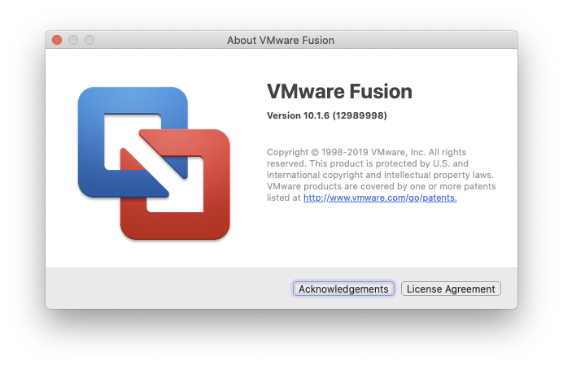
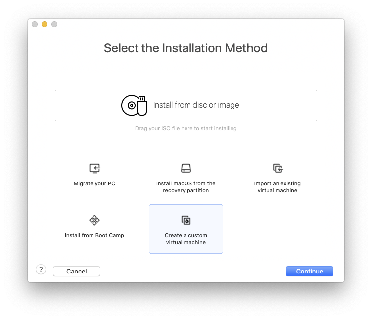
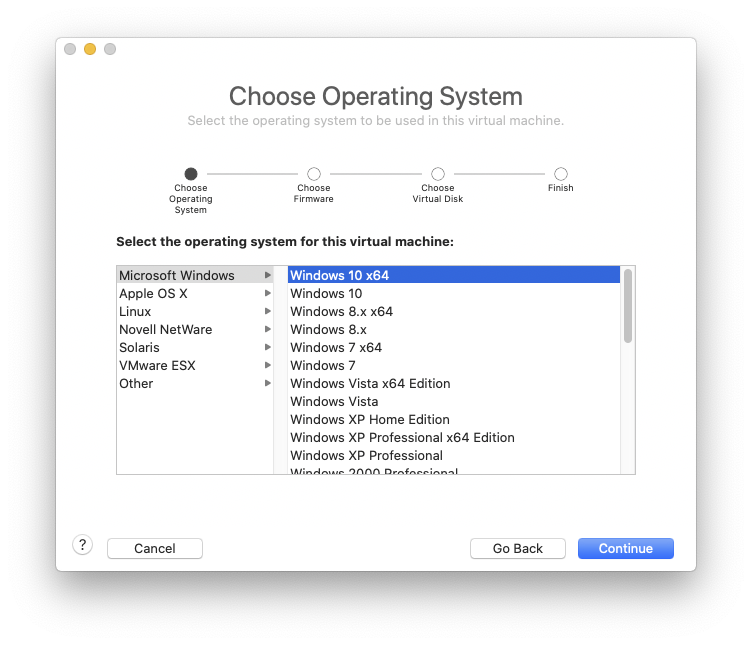
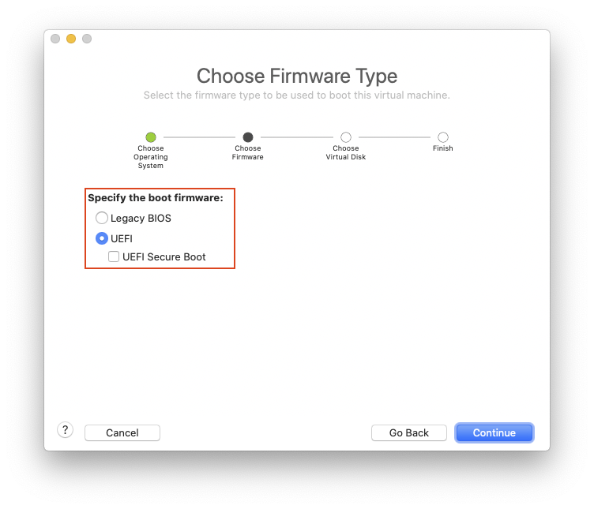
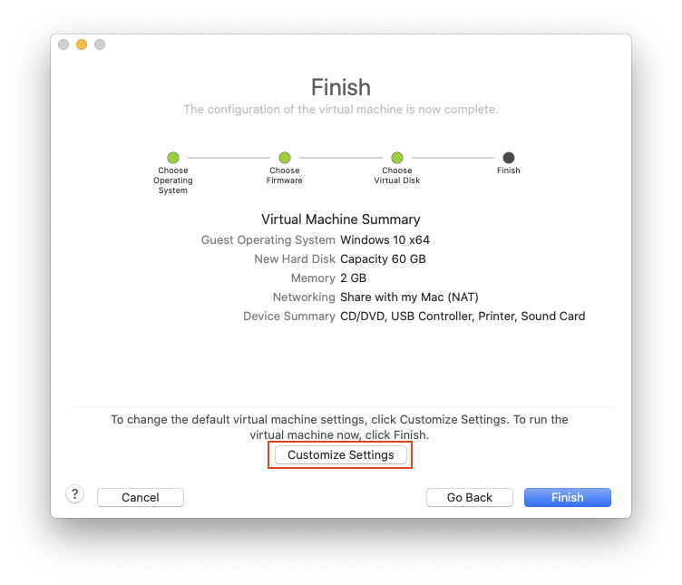
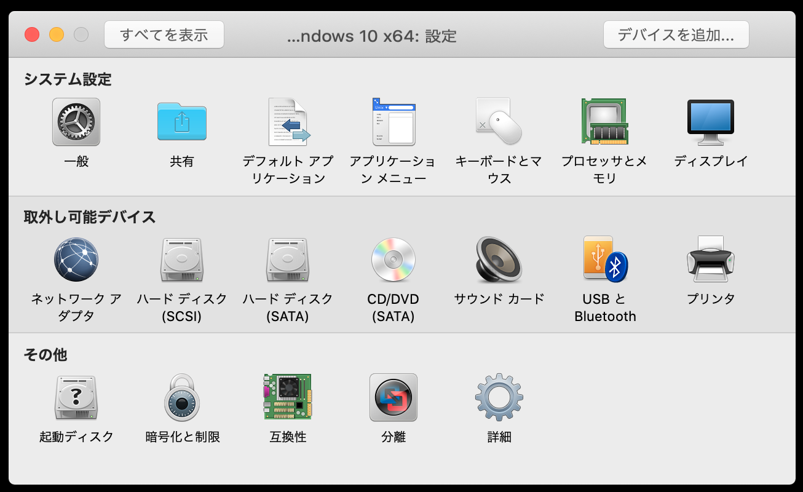
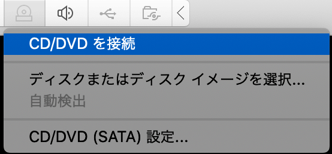
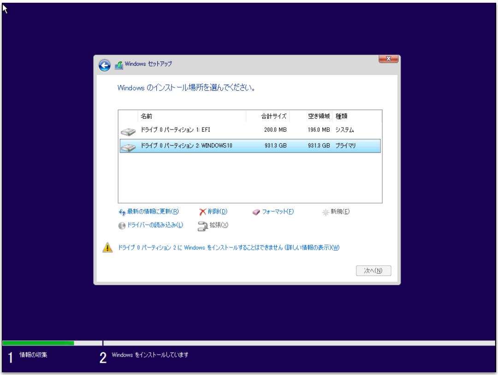
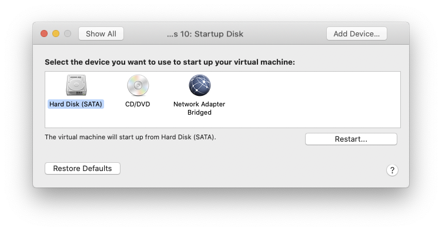
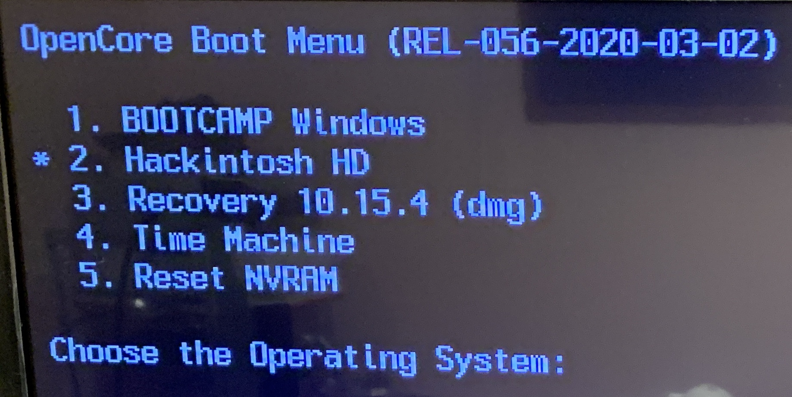

### 目的

Hackintosh上で、macOSとは別のSSDにインストールしたWindowsをデュアルブートしたい。さらにVMware Fusionを使って、macOS上で仮想マシンとして同じSSDからWindowsを実行したい。

最近のOpenCoreであればBootcamp経由でWindowsの起動が可能[1][]のようですが、今回はBootcampを使わない方法です。

### 環境

- macOS X Catalina 10.15.4
- VMware Fusion 10.1.6
- Windows 10

自分のマシンはRyzentosh (AMD Ryzen 3900X）なのでVMware Fusion 11が現状では動きません。また、VMware Fusion 10をCatalinaで起動すると画面が真っ黒になる問題があるので別途の対応が必要です。

### VMware Fusion 10で仮想マシンを準備

VMware Fusion 10を起動して入れ物となる仮想マシンを作成します。

#### 1. カスタム仮想マシンを作成



#### 2. Windows 10 x64を選択する



#### 3. UEFI（必ずUEFIを選び、UEFIセキュアブートはチェックしない）



#### 4. 必要に応じて設定のカスタマイズ（コア数・メモリ・ネットワークなど必要に応じて）して 新しい仮想ディスクを作成



この時点ではWindows 10のインストールは行いません。

### Windows 10用のドライブを用意

適当なSSDをUSBまたはSATAポートに接続して用意します。接続が確認できたらGPTパーティションマップでフォーマットします。

#### 方法1：ディスクユーティリティを使う

ディスクユーティリティを起動したら、⌘2を押してデバイス単位で表示し、ターゲットとなるディスクデバイスを選択し、「消去」します。

```bash
名前：  WINDOWS10 （任意の名前でOK)
フォーマット：  FATまたはexFAT
方式：  GUIDパーティションマップ
```
として全体で一つのパーティションとなるようにフォーマットしておきます。同時に、装置の欄に表示されているデバイス名をメモしておきます（`disk0`など）。

#### 方法2：ターミナルからコマンドラインを使う

接続されたディスクの一覧を表示します。

```bash
# diskutil list
...
...
...
/dev/disk3 (internal, physical):
   #:                       TYPE NAME                    SIZE       IDENTIFIER
   0:      GUID_partition_scheme                        *1.1 TB     disk3
   1:                        EFI EFI                     209.7 MB   disk3s1
   2:       Microsoft Basic Data WINDOWS10               1.0 TB     disk3s2
...
...
...   
```

ターゲットとなるドライブのデバイス名を確認します（ここでは`/dev/disk3`となります）。次に該当のドライブをexFAT形式で単一のボリュームとしてフォーマットします。最後のデバイス名を間違えないように注意。

```bash
# diskutil eraseDisk ExFAT WINDOWS10 GPT /dev/disk3
```

### 物理ディスクを参照する仮想ドライブを作成

VMware Fusionのコマンドラインツールを使い[こちら](http://techrem.blogspot.jp/2012/12/add-physical-disk-to-vmware-fusion.html)や[こちら](https://kb.vmware.com/s/article/2097401)を参考に、*物理ディスク全体を参照する仮想ドライブ*を先程作成した仮想マシンのフォルダ内に`.vmdk`ファイルとして作成します。

```
# /Applications/VMware\ Fusion.app/Contents/Library/vmware-rawdiskCreator create /dev/disk3 fullDevice ~/Documents/Virtual\ Machines.localized/Windows\ 10.vmwarevm/disk3 sata
```

- 1番目の引数は実行するコマンド、ここでは`create`
- 2番目の引数にターゲットとなるデバイス名を指定（今回は/dev/disk3）
- 3番目の引数を`fullDevice`とすることよりデバイス全体を指定
- 4番目の引数は`.vmdk`ファイル名を指定。ここでは、仮想マシンがあるディレクトリ下に`disk3.vmdk`と指定
- 5番目の引数はバスタイプを指定、ここでは`sata`

このコマンドを実行すると以下のような`disk3.vmdk`が追加されます。

```
# ls ~/Documents/Virtual\ Machines.localized/Windows\ 10.vmwarevm/
Windows 10 x64.plist		disk3.vmdk			仮想ディスク-s004.vmdk		仮想ディスク-s008.vmdk		仮想ディスク-s012.vmdk		仮想ディスク-s016.vmdk
Windows 10 x64.vmsd		仮想ディスク-s001.vmdk		仮想ディスク-s005.vmdk		仮想ディスク-s009.vmdk		仮想ディスク-s013.vmdk		仮想ディスク.vmdk
Windows 10 x64.vmx		仮想ディスク-s002.vmdk		仮想ディスク-s006.vmdk		仮想ディスク-s010.vmdk		仮想ディスク-s014.vmdk
Windows 10 x64.vmxf		仮想ディスク-s003.vmdk		仮想ディスク-s007.vmdk		仮想ディスク-s011.vmdk		仮想ディスク-s015.vmdk
```

### 仮想ドライブを仮想マシンから参照

仮想マシンのディレクトリに移動します。

```
cd ~/Documents/Virtual\ Machines.localized/Windows\ 10.vmwarevm/
```

このディレクトリ内にある`.vmx`の拡張子を持つファイルをエディタで開き、下記の内容を最後に追記します。

```
sata0:0.present = "TRUE"
sata0:0.fileName = "disk3.vmdk"
sata0:0.deviceType = "rawDisk"
suspend.disabled = "TRUE"
```

### 仮想マシンからディスクの参照が出来ることを確認

VMware Fusionを起動して仮想マシンの設定を開くと、「ハードディスク（SATA)」が追加されているはずです。



ここで、「ハードディスク（SCSI）」は不要なので、「詳細オプション」を開いて「ハードディスクを削除」クリックして削除します。

### Windows 10をインストール

残りの作業はほぼ通常通りで、予めダウンロードしておいたWindows 10のISOイメージファイルを「CD/DVD」としてマウントし、起動ディスクにセッして起動します。



通常通りにWindowsのインストールを進め、「Windowsのインストール場所を選んで下さい。」まで来ると先程作成した仮想ドライブが表示されます。このままインストールを続けるとUEFIから起動が出来ません。



そこで全てのパーティションを削除して、「新規(E)」を選び最大容量でパーティションを作成します。自動的にWindowsの起動に必要なシステム関係のパーティションが作成されます。残りの作業は仮想マシン上でほぼ自動的に進みます。

### 起動ディスクを変更

インストールが完了したら、一度シャットダウンします。「CD/DVD」のマウントを解除し、設定から起動ディスクを「ハードディスク（SATA）」に変更します。



### UEFIからの起動を確認

一度macOSを再起動してBIOSからWindowsの入ったドライブを選択して起動し、自分のPCに応じたドライバ類をインストールしセットアップします。

また、OpenCoreのブートメニューでは`BOOTCAMP Windows`として認識されWindowsの起動が可能となります。



## 終わりに

ちょっと面倒な手順を踏みますが、**Bootcampに依存せず**にデュアルブートかつVMwareからの利用が可能となります。普段はmacOS上で作業し、古い会計ソフトなどでWindowsが必要な場合はVMware上のWindowsから実行します。また、GPUが必要となる最新のWindows専用のゲームをプレイしたい場合などは、再起動して普通のPCとして同じドライブからWindowsを起動して実行します。

VMware上でWindowsを起動した場合、Radeon™ Software Adrenalinなどのハードウェアに依存するソフトウェアはエラーダイアログが表示されますが、そのまま閉じてしまって害はなさそうです。

[1]: https://osy.gitbook.io/hac-mini-guide/installation-guide/boot-camp "OpenCore Boot Camp"