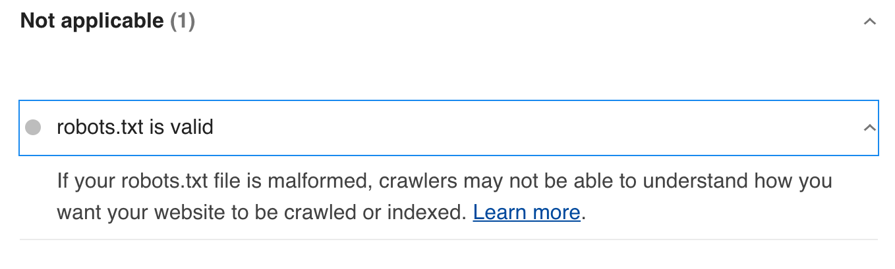
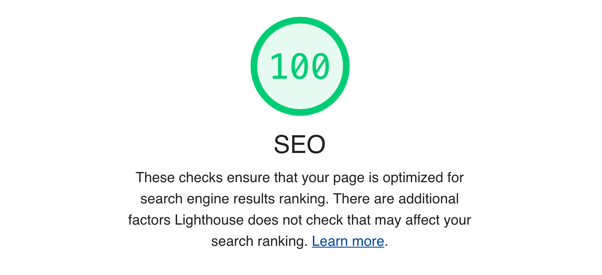

### 気づいた制約事項

- ファイルやディレクトリの名称に使える文字に制限がある。実装としてelmのレコードに変換されるために、

### netlifyのリダイレクトを設定する

`elm-pages`は
```netlify.toml
[[redirects]]
  from = "/*"
  to = "/index.html"
  status = 200
```

### robots.txtを設置する

Lighthouseで満点を目指していると、`robots.txt`の内容が間違っているとエラーが発生する。ルートに`robots.txt`ファイルを作成しても改善しない。どうやらリダイレクトの設定で`index.html`を見に行ってしまうのが原因。

まずはじめに試したのは`netlify.toml`の設定を下記のように変更してみる。

```
[[redirects]]
  from = "/robots.txt"
  to = "/robots.txt"
  status = 200  
[[redirects]]
  from = "/*"
  to = "/index.html"
  status = 200
```  

しかし`/robots.txt`にアクセスすると404エラーとなってしまい、Lighthouseもスルー（汗



少し調べて思いついたのは、どうやら`sitemap.xml`やRSSフィードを生成する部分で、`robots.txt`も一緒に生成してしまえば良さそう。実際にこれらの静的ファイルを生成する部分は、`Main.elm`の`generateFiles`関数になります。

```elm
generateFiles :
    List
        { path : PagePath Pages.PathKey
        , frontmatter : Metadata
        , body : String
        }
    ->
        List
            (Result String
                { path : List String
                , content : String
                }
            )
generateFiles siteMetadata =
    [ Feed.fileToGenerate { siteTagline = siteTagline, siteUrl = canonicalSiteUrl } siteMetadata |> Ok
    , MySitemap.build { siteUrl = canonicalSiteUrl } siteMetadata |> Ok
    , Ok
        { path = [ "robots.txt" ]
        , content = "User-agent: *\nDisallow: /admin\nSitemap: https://www.saitama783.info/sitemap.xml\n"
        }
    ]
```

このリストの最後の部分で`robots.txt`を生成するよう指示しています。

再びLighthouseを走らせて見ると、見事にSEOが100点に！

