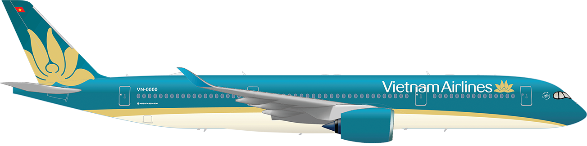

## プランニング

今年のお正月休みはカレンダーと定休日の兼ね合いもあって、12月31日まで営業して1月1日から8日までお休みをいただきました。寒い日本を脱出して暖かいところに旅行に行く機会が多く今回選んだのは常夏のベトナム・ホーチミン。

ベトナムは日本より南に位置しますが、縦長のため南と北で気候も大きく異なり、この時期のハノイや人気のダナンなどは実は暑くはなく、海やプールで泳ぐのも厳しい感じだそうで、ホーチミン一択となりました。

ただしホーチミンには海がないため、ちょっとはリゾード気分も味わいたい、コンダオ島やフーコック島も検討しましたが、どちらも流刑地だった過去もあり敏感な奥様が敬遠したため、ベトナムの熱海とも呼ばれるブンタウに行くことにしました。

### フライトの概要

今回選んだ航空会社は以下のベトナム航空の直行便、

- VN301 NRT 09:30 - SGN 14:45
- VN300 SGN 00:10 - NRT 07:45 

日系の航空会社だと往路が午後または夜間しかなく、復路も早朝発か深夜便しかないので、時間を有効に使えるこの組み合わせが最適と判断してえらびました。

ベトナム航空の日本線にはエアバスの最新型A350-900が導入されています。

エコノミー・プレミアムエコノミー・ビジネスの3クラスですが、繁忙期ということもあってかなぜかプレエコのほうがエコよりも安いという逆転現象に遭遇し、往復ともにプレエコの利用となりました。

### ホーチミンでのホテル

### ブンタウへの移動

