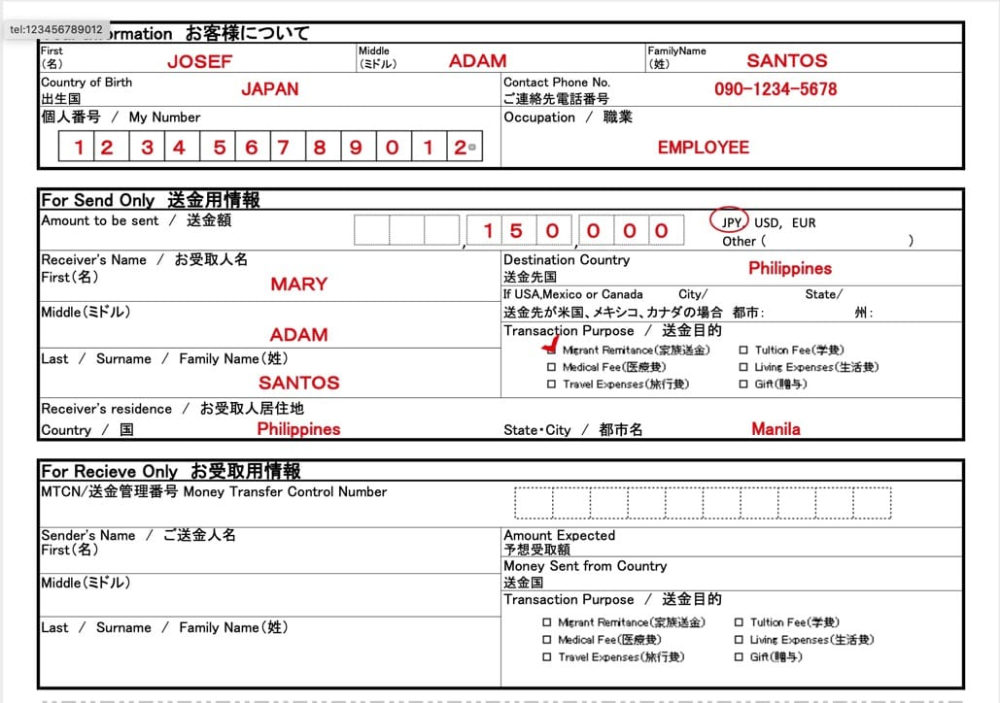
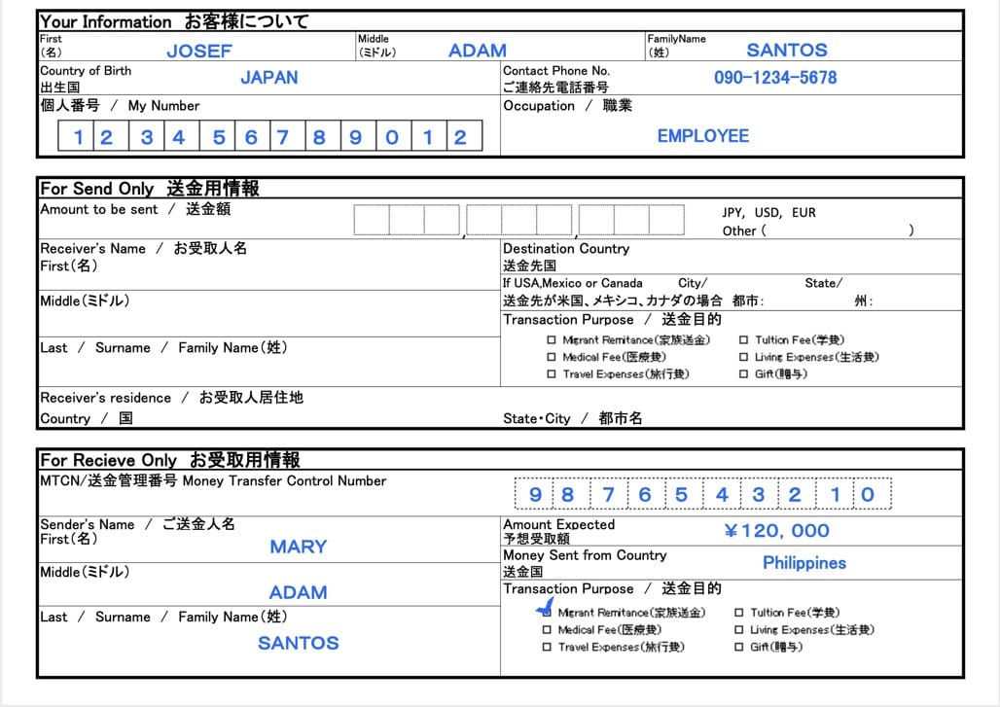

**2021年2月より国際送金のコンプライアンス要件が変更され、こちらの内容は一部無効となっている部分がございますのでご注意ください。変更点は[こちら](/post/western-union-form/)をご参照ください。**

ウェスタンユニオンにて送金または受け取りの際に[こちらのメモ](/wu-memo.pdf)を事前に記入して準備していただきますとスムーズにお手続きが可能です。以下に記入例をご紹介いたします。

パソコンやスマホで送金メモを作成するツールをご用意いたしました。下記のリンクから作成が可能ですのでお試しください。<a href=https://wu-form.officeiko.co.jp/ target="_blank">こちら</a>

## お客様の情報

送金人様のお名前をアルファベットで正確に記入してください。WU側から送金内容や相手様に関する確認の電話（インタビュー）がある場合がございますので、普段からお使いの電話番号を正しく記入してください。

職業欄は大まかな表現で問題ございません。

例：会社員　EMPLOYEE / 主婦　HOUSE WIFE

## 送金の場合

受取人様のお名前を正確に記入してください。スペルの間違いや姓と名が入れ替わっていると、先方にて受け取ることができません。

送金目的は家族送金や生活費・医療費など実情に合わせてご選択ください。贈与や商品仕入れ代金などはWUのポリシーに反する場合がございますのでご注意ください。

送金額を円建てで指定する場合はJPYを選んでください。相手先通貨で指定することも可能でございます。手数料を込みで指定したい場合、送金時にその旨をスタッフまでお知らせください（込みで10,000円など）。

**韓国・台湾**へご送金の場合は、相手先国の規制により現地通貨での指定ができません。USDにて送金のうえ受取先にて現地通貨へ再度の両替が行われます。したがいまして、二重両替となるためレート的には不利になりますのでご注意ください。

## 受け取りの場合

送金人様から受け取りましたMTCN(Money Transfer Control Number)を正確にご記入ください。

送金人様の名前を正確にご記入ください。当店で受け取った情報と相違がございますとお渡しができません。

送金目的は家族送金や生活費・医療費など実情に合わせてご選択ください。贈与や商品仕入れ代金などはWUのポリシーに反する場合がございますのでご注意ください。

予想受取金額はおよそで結構でございます。

## 為替レートについて

[こちら](https://www.westernunion.com/jp/ja/web/send-money/start)のリンクから送金額をお見積りいただけます。実際の為替レートとは異なる場合がございます。

当店では**現金**での送金・受取のお取り扱いとなっております。***銀行口座への送金やWUアプリのお取扱いをいたしておりません***のでご注意ください。

### オンラインと店頭現金では手数料体系が異なりますのでご了承ください。

## 必要となる本人確認書類

犯罪収益移転防止法に基づき、下記の書類が**毎回**必要となりますので忘れずに持ちください。

**日本国籍の場合：**
  1. 日本のパスポートまたは運転免許証
  2. 個人番号カードまたは個人番号記載の住民票（発行から６ヶ月以内のもの）

**外国籍移住者：**
  1. 在留カード
  2. 個人番号カードまたは個人番号記載の住民票（発行から６ヶ月以内のもの）